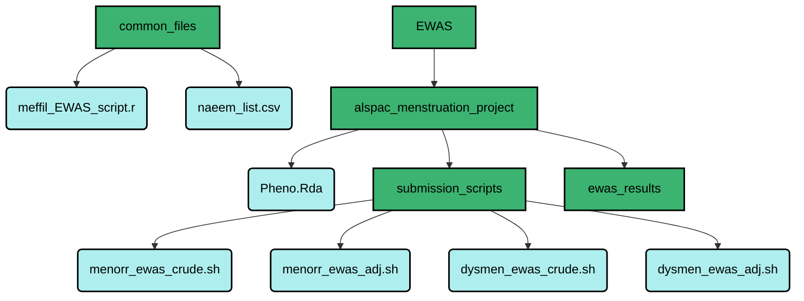

# BlueCrystal Steps for EWAS

  Author:   Flo Martin  
  Date:     19/11/2020

## Logging in & setting up your home directory
To log in to BlueCrystal, open Terminal whilst connected to the UoB server via F5 Access. Type:

```
ssh -X username@bluecrystalp3.bris.ac.uk
```

Then enter your password when prompted :key:

Once logged in, take a look at the working directory:

```
pwd
```

This command will bring up the current working directory, which will be the home directory every time you log in:

```
/newhome/ti19522
```

To see the folders and files in the current working directory type:

```
ls
```

This will bring up a list of files within the current working directory. To create a new folder in the current directory, type:

```
mkdir new_folder_name
```

This will create a new folder in the current working directory. To move this folder from the current working directory into a folder within the directory e.g. move new_folder_name into new_folder_location in the home directory, type:

```
mv new_folder_name new_folder_location
```

To check this has worked, type:

```
ls new_folder_location
```

If this new folder needs to be moved again, into a subfolder within new_folder_location, for example, we need to change the working directory:

```
cd /newhome/ti19522/new_folder_location
```

Then we can move new_folder_name into subfolder_location by using the move command again:

```
mv new_folder_name subfolder_location
```

Always use `ls` and `pwd` along the way to double check the files we have access to from which area of your home directory. Similarly to Gemma, I have my home directory organised into:

<div align="center">


</div>


<div align="left"> Shown in green are the folders situated in the remote working directory and in blue, files used for analysis. My folder "alspac_menstruation_project" is specific to my mini project 1; within this folder I keep specific submission scripts and EWAS results for this project. In the future I may add other folders with EWAS that will refer to different projects.
  
## Moving files between your local directory & remote directory
### Local &rarr; Remote

If working in `ssh` session, log out using <kbd>Ctrl</kbd> + <kbd>d</kbd> then relogin using:

```
sftp username@bluecrystalp3.bris.ac.uk
```

Then enter your password when prompted :key:
