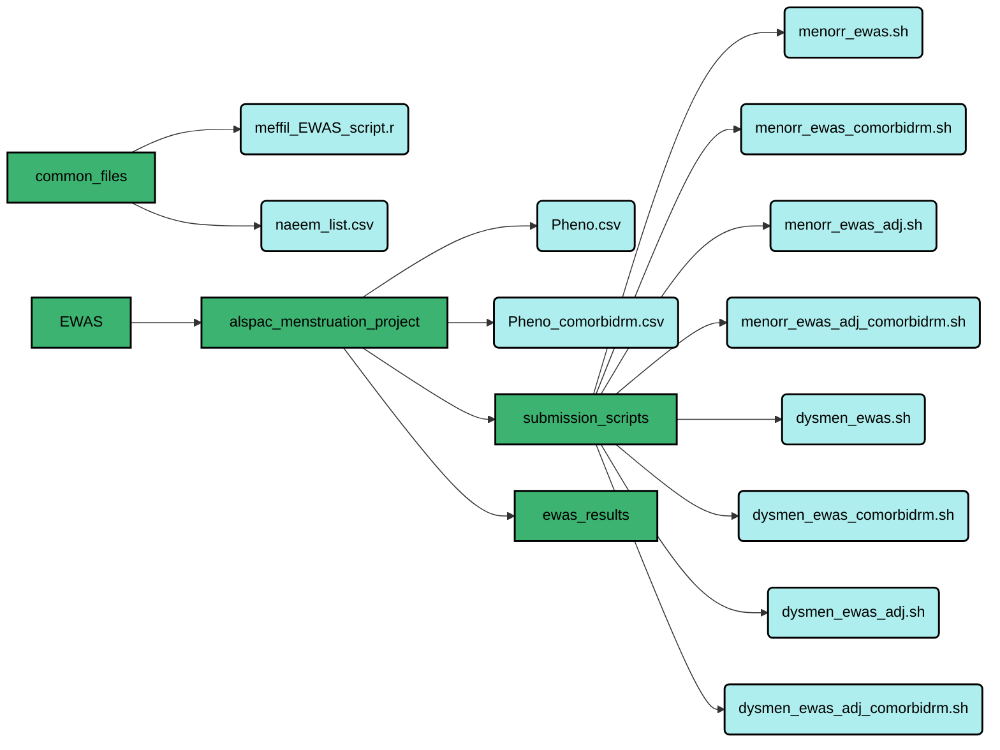

# BlueCrystal Steps for EWAS

  Author:   Flo Martin  
  Date:     19/11/2020

## Logging in & setting up your home directory
To log in to BlueCrystal, open Terminal whilst connected to the UoB server via F5 Access. Type:

```
ssh -X username@bluecrystalp3.bris.ac.uk
```

Then enter your password when prompted :key:

Once logged in, take a look at the working directory:

```
pwd
```

This command will bring up the current working directory, which will be the home directory every time you log in:

```
/newhome/ti19522
```

To see the folders and files in the current working directory type:

```
ls
```

This will bring up a list of files within the current working directory. To create a new folder in the current directory, type:

```
mkdir new_folder_name
```

This will create a new folder in the current working directory. To move this folder from the current working directory into a folder within the directory e.g. move new_folder_name into new_folder_location in the home directory, type:

```
mv new_folder_name new_folder_location
```

To check this has worked, type:

```
ls new_folder_location
```

If this new folder needs to be moved again, into a subfolder within new_folder_location, for example, we need to change the working directory:

```
cd /newhome/ti19522/new_folder_location
```

Then we can move new_folder_name into subfolder_location by using the move command again:

```
mv new_folder_name subfolder_location
```

Always use `ls` and `pwd` along the way to double check the files we have access to from which area of your home directory. Similarly to Gemma, I have my home directory organised into:


<div align="center">


      
       
<div align="left"> Shown in green are the folders situated in the remote working directory and in blue, files used for analysis. My folder "alspac_menstruation_project" is specific to my mini project 1; within this folder I keep specific submission scripts and EWAS results for this project. In the future I may add other folders with EWAS that will refer to different projects.
  
## Moving files between your local directory & remote directory
### Local &rarr; Remote

If working in `ssh` session, log out using <kbd>Ctrl</kbd> + <kbd>d</kbd> then relogin using:

```
sftp username@bluecrystalp3.bris.ac.uk
```

Then enter your password when prompted :key:

During this session, it is possible to interact with both your local and remote working directories. To view the files listed within your local directory, type:

```
lls
```

And to change the local directory to where the file you want to move is located, use:

```
lcd /pathname/from/computer
```

To move a file from your local working directory to your remote working directory, type:

```
put filename.csv
```

And this file will move to your remote working directory. From there you can manipulate it's location as described in the previous seciton.

### Remote &rarr; Local

Still within the `sftp` session, you can move files from your remote working directory to your local working directory. Similarly to the last step the working directories can be checked and changed using the commands `lls` & `lcd` (local) and `ls` & `cd` (remote). Once your directories are correctly set, use:

```
get filename.csv
```

To move a file from the remote working directory to the local working directory.

## Merging the `samplesheet` (ARIES) with an ALSPAC dataset
In the event that you have an ALSPAC dataset that you want to merge with the ARIES dataset for epigenetic analysis, `samplesheet` must be merged with the dataset in order to link ALN identification numbers with Sentrix numbers from the lab. To move forward with this step, you will need:
  - [x] An ALSPAC dataset (in `.dta`, `.csv` or `.Rda` format)
  - [x] A BlueCrystal account
  - [x] Access to ARIES (contact ieu-datamanagement@bristol.ac.uk)
  
Once these steps have been completed then the dataset can be merged with the ARIES `samplesheet`. Open Terminal and log in. If R isn't installed, type:

```
vim .bash_profile
```

To open a text editor, then alter the text to mirror:

```
# .bash_profile

# Get the aliases and functions
if [ -f ~/.bashrc ]; then
        . ~/.bashrc
fi

# User specific environment and startup programs
module add languages/R-3.6.3-gcc9.1.0
PATH=$PATH:$HOME/bin

export PATH
```

To implement, press <kbd>Esc</kbd>, then type `:x` and press <kbd>Enter</kbd>. You will need to logout and log back in to an `ssh -X` session (described in the last section).

Now that R is installed in your BlueCrystal environment you can open it by typing:

```
R
```

To load `samplesheet` into the R environment, type:

```
load ("/panfs/panasas01/dedicated-mrcieu/studies/latest/alspac/epigenetic/methylation/450k/aries/released/20-05-03/data/samplesheet/data.Robj")
```

And check this has worked by typing `ls()`. It should show `[1] samplesheet` if it has successfully loaded in. If you haven't 'called' the arguments for the EWAS using the submission script, then you need to assign a value to `TP` (timepoint) for whichever timepoint you will be using in your EWAS. In this example, I am using the adolescent timepoint, where methylation was measured at either 15 or 17 years of age:

```
TP <- "15up"
```

Once TP has been assigned the specific timepoint being used in the EWAS, type:

```
if(TP !="antenatal" & TP !="FOM"){
   qletB <- samplesheet$ALN[which(samplesheet$QLET=="B")]                # Find alns for multiple pregnancies
   samplesheet <- samplesheet[-which(samplesheet$ALN %in% qletB),]       # Remove multiple pregnancies
 }
```

This bit of code removes multiple pregnancies to either prevent mother's being counted twice (if using mum's in the EWAS) or removing twins to limit bias introduced by population stratification when including siblings into EWAS analyses. Using `dim(samplesheet)` to check the number of rows and columns following this step (at time of writing this generated 977 rows). Using `names(samplesheet)` allows oyu to interrogate the column names in `samplesheet` and `table(samplesheet$time_code)` allows us to confirm that the methylation measures were only taken in the specified period of time assigned by `TP`. Another quality control step is removing duplicates, flagged by the column `duplicates.rm`. To do this, type:

```
table(samplesheet$duplicate.rm)                                          # This allows you to check the number of duplicates present in samplesheet
samplesheet <- samplesheet[-which(samplesheet$duplicate.rm=="Remove"),]  # This removes the duplicates from the samplesheet
```

Using `dim(samplesheet)` again we can double check that the right number of duplicates have been removed. Now we can merge the resultant `samplesheet` with the local ALSPAC dataset. Make sure the dataset you want to merge is loaded into the remote environment and you working directory is set to the file location within R:

```
getwd()
setwd("/remote/location/of/ALSPAC/file")
load("alspac_data.Rda")
```

Now that the ALSPAC dataset file has been loaded into the remote R environment, we can merge it with `samplesheet`, using:

```
Pheno <- merge(alspac_data, samplesheet, by.x="aln", by.y="ALN")         # This last part makes sure that the ALNs in each dataset are matched irrespective of case
```

If we then use `dim(Pheno)` we can check that the number of rows matches that of `samplesheet` and the number of columns matches that of `alspac_data` + `samplesheet`. If all looks groovy, we can save `Pheno` as a dataset for manipulation in local R before use in an EWAS analysis!

```
save(Pheno, file="Pheno.Rda")
```

This will save to the remote working directory that was set in R. Move the file from the remote to lcoal directory using the section above.

Now that the dataset has been successfully merged and moved from the remote directory to the local directory, it can be manipulated as needed ready for the EWAS analysis. Any covariates required that relied on having the methylation measurement timing can be derived and `Pheno.Rda` can be moved back to the remote directory ready for use in EWAS.

## Running the EWAS analysis in BlueCrystal
Now that we have the merged dataset, we can gathering together the necessary submission scripts and files needed to run the EWAS using `meffil`. First thing I need to do is write the submission script for the EWAS I want to run. I am going to use the unadjusted menorrhagia EWAS as an example here. The submission script for this EWAS is created in a Terminal session, using the `nano` command with the working directory set as `submission_scripts`:

```
nano menorr_ewas.sh
```

This will open a text editor which the following text can be added:

```
#!/bin/bash
#
#
#PBS -l nodes=1:ppn=1,walltime=12:00:00

WORK_DIR="/newhome/ti19522/EWAS/alspac_menstruation_project"
module add languages/R-3.6.3

R CMD BATCH --no-save --no-restore '--args menorr_ewas houseman Cells Pheno B 15up age_meth /newhome/ti19522/EWAS/alspac_menstruation_project' /newhome/ti19522/common_files/meffil_EWAS_script.r /newhome/ti19522/EWAS/alspac_menstruation_project/ewas_results/menorr_ewas.out
```

This shell file is the 'job' that is submitted to BlueCrystal and draws on the `meffil_EWAS_script.r` to complete the analysis. _More info on what each of the elements within the shell file in the EWAS Anaysis Plan._ 

The job is then submitted to BlueCrystal using the command:

```
qsub ~/EWAS/alspac_menstruation_project/submission_scripts/menorr_ewas.sh
```

The progress of the job can be checked using:

```
qstat -U username
```

To ensure that the job runs smoothly, double check that `meffil` is in your remote R environment library. Open R in Terminal by typing `R` and check what version R is installed. If the newest version is installed (time of writing version 3.6.3) this is too new to follow Matt Suderman's instructions but too old for the newest version of Bioconductor. To get around this, install an older version of R into your BlueCrystal environment to be able to follow Matt's instructions. Quit R `q()` and type:

```
module add languages/R-3.4.1-ATLAS
```

Then reopen R & check which version is now running. If version 3.4.1 is running, then Matt's instructions for installing `meffil` can be used:

```
source("http://bioconductor.org/biocLite.R")
install.packages("devtools")
library(devtools)
install_github("perishky/meffil")
```

These steps take quite a long time so bear with it!
