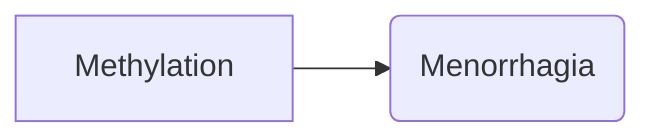
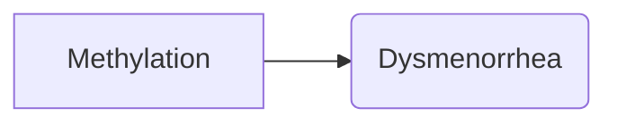
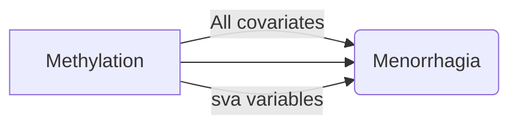
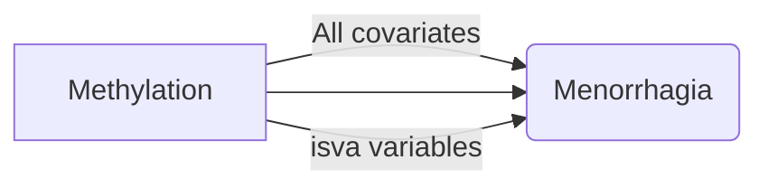

# EWAS using `meffil` following Gemma's pipeline

The following shows the steps needed to take to perform an EWAS using ARIES and the R package `meffil`. The outcome will be linear regression where methylation is the outcome and menorrhagia is the exposure:

<div align="center">



<div align="left">

Or dysmenorrhea is the exposure:

<div align="center">



<div align="left">

Four models will be run for each input file (two input files in total for each period-related outcome), for example:

<div align="center">

### No covariates


### All covariates
      
```mermaid
graph LR

A[Methylation]

A *-->|Age| B(Menorrhagia)
A -->|BMI| B(Menorrhagia)
A -->|Contraception| B(Menorrhagia)
A -->|Maternal education| B(Menorrhagia)
A --> B(Menorrhagia)
A -->|Maternal occupation| B(Menorrhagia)
A -->|Smoking| B(Menorrhagia)
A -->|Alcohol| B(Menorrhagia)
A -->|Comorbidities| B(Menorrhagia)
```

### All covariates + sva variables



### All covariates + isva variables



So have run the two outcomes, I will end up with 8 results: four for each outcome.

<div align="left">

## Set up
I need to set up folders on my home directory. I need a file called `common_files` in which I will keep three files:
- `naeem_list.csv` which is a list of probes (in Gemma's repository) that have been identified as potentially problematic (on a SNP, cross-hybridising etc.). A list of probes on the array 
tat have the potential to provide a noisy methylation signal, therefore reducing false discovery rate that is the result of these noisy signals (1).
- `aries-detailed-cell-counts-20150409.Rda` which is a list of dataframes (one for each ARIES timepoint) with cells counts estimated using the Houseman methods but 
where granulocytes are split into eosinophils and neutophils. The Houseman method is similar to regression calibration (technique that corrects biases in regression results in situations where exposue variables are measured with error) which infers changes in the distribution of white blood cells between different 
subpopulations using DNA methylation signatures, in combination with a previously obtained external validation set consisting of signatures from purified leukocyte 
samples (2). I won't need this for my menorrhagia/dysmenorrhea EWAS.
- `meffil_EWAS_script.r` which is Gemma's EWAS R script (also in the repository). It should stay generic so you can use the same script to run any ARIES EWAS.

I need another file called `EWAS` with subfolders for different projects, at the moment I would only need one for mini project one `mp1` with subfolders:
- `submission_scripts` which contains all the .sh files used to 'call' the R EWAS script. These .sh files are unique for each EWAS because they list the arguments that are read into the R script at the start of the EWAS, specific to the outcome of interest.
- `ewas_results` where all the outputs from the EWAS are saved.
- `mp1` which is the phenotype file (file containing all the covariates and the variable of interest)

## `.sh` files
Need to make an `.sh` file for each EWAS I want to run, so two `.sh` files: menorrhagia and dysmenorrhea, then submit them as separate jobs.

```
#!/bin/bash
#
#
#PBS -l nodes=1:ppn=1,walltime=12:00:00
```

Then set the working directory:

`WORK_DIR="/panfs/panasas01/sscm/ti19522/EWAS/mp1"`

Next tell it to install R:

`module add languages/R-3.6.3`

Then change the working directory as in R:

`cd $WORK_DIR`

The next line is specific to each individual EWAS:

```
R CMD BATCH --no-save --no-restore '--args Trait CellData CellAdj Phenofile BorM TP Covariates WD' /newhome/ti19522/common_files/meffil_EWAS_script.r /newhome/ti19522/EWAS/alspac_menstruation_project/menorr_ewas.out
```
      
Where:
- `Trait`       = the trait of interest as it appears in the phenofile, therefore `menorr_drvisit_ever` and `dysmen_drvisit_ever`
- `CellData`    = cell counts (Houseman or houseman_eos)
- `CellAdj`     = adjusting for estimated cells (yes or no)
- `Phenofile`   = name of the file containing all the phenotype information (mp1.Rda but saved as a `.csv`)
- `BorM`        = use beta values (0 to 1 - more intuitive) or M values (logit transformation of beta values)
- `TP`          = ARIES time-point (15up?)
- `Covariates`  = the list of covariates we want to adjust for in the model (in the phenofile - `mat_edu`,`smoker_ever` etc.)
- `WD`          = the directory for the EWAS project

The last bits of the line are the file path to the R script and the file path to an `.out` file (called mp1_menorr.out for HMB for example), which will show the output from R to see how the EWAS is doing. Call the `.out` file the same name as the `.sh` file then save them in the `ewas_results` folder within the project subfolder.

```
R CMD BATCH --no-save --no-restore '--args menorr_ewas houseman Cells mp1 B 15up age_meth,men_age_m,bmi_meth,contraception_meth,mat_edu,mat_occ_class,reg_smoker,reg_drinker,comorbidity /newhome/ti19522/EWAS/' /newhome/ti19522/common_files/meffil_EWAS_script.r /newhome/ti19522/EWAS/alspac_menstruation_project/menorr_ewas.out
```

This should then be saved in the `submission_scripts` folder then submit it to BlueCrystal:

```
qsub EWAS/alspac_menstruation_project/submission_scripts/menorr_ewas.sh
```

## The EWAS R Script
The actual EWAS all happens in R but is automated by the `.sh` script, so there should be no need to open R unless there's a problem. The R script is called `meffil_EWAS_script.R` and is stored in the `common_files` folder:

```
args <- commandArgs(trailingOnly = TRUE)    # Pull the arguments
Trait <- toString(args[1])                  # Phenotypic exposure or outcome of interest
CellData <- toString(args[2])               # Which cell counts should we use? (houseman, gse68456, gervinandlyle, andrews-and-bakulski, houseman_eos)
CellAdj <- toString(args[3])                # Cell adjusted? (noCells, Cells)
Phenofile <- toString(args[4])              # Path to file containing all phenotype information (must be a dta stata version 12)
BorM <- toString(args[5])                   # Beta values or M-values (B or M)
TP <- toString(args[6])                     # Time point (cord or F7 or 15up or antenatal or FOM)
Covariates <- toString(args[7])             # List of covariates (eg: m_age,mum_uni,matsm,parity i.e. commas but no spaces or quotation marks)
WD <- toString(args[8])                     # Working directory (eg /newhome/ti19522/EWAS/alspac_menstruation_project)
```
This part of the script pulls in the arguments that were set in the `.sh` file.

```
print(Trait)
print(CellData)
print(CellAdj)
print(Phenofile)
print(BorM)
print(TP)
print(Covariates)
print(WD)
```
This part checks they've been set properly.

```
setwd(/newhome/ti19522/EWAS/alspac_menstruation_project)
```
This part sets the working directory to the specific EWAS project folder.

```
library(foreign)  # To read stata file
library(meffil)   # To run EWAS
```
This part installs the necessary R packages.

```
load("/panfs/panasas01/dedicated-mrcieu/studies/latest/alspac/epigenetic/methylation/450k/aries/released/2016-05-03/data/samplesheet/data.Robj")
```
This describes the ARIES samples stored in an R object in the IEU directory on BlueCrystal.

```
samplesheet <- subset(samplesheet, time_point==15up)
```
Because I don't want all the ARIES samples, just the ones from the 15 or 17 timepoints, this line extracts the info on the samples specific to the time-point of interest.

```
load("/panfs/panasas01/dedicated-mrcieu/studies/latest/alspac/epigenetic/methylation/450k/aries/released/2016-05-03/data/betas/data.Robj")
```
This accesses the ARIES methylation data also stored on BlueCrystal.

```
meth <- norm.beta.random[,samplesheet$Sample_Name] # Keep the samples that correspond to the time point you're interested in
```

This line gets rid of any samples in the ARIES methylation data that correspond to time-points I'm not interested in.

```
rm(norm.beta.random)
```
This line removes `norm.beta.random` because it has been turned to `meth` so tidies it up getting rid of it.

```
load("/panfs/panasas01/dedicated-mrcieu/studies/latest/alspac/epigenetic/methylation/450k/aries/released/2016-05-03/data/detection_p_values/data.Robj")
pvals <- detp[,samplesheet$Sample_Name] # Keep the samples that correspond to the time-point you're interested in
rm(detp)
```
This line loads detection _p_-values used to filter all probes with a high detection _p_-value and give an idea of how well each probe and sample has performed. The next line selects the _p_-values that correspond to the time-point I'm interested in.

```
annotation <- meffil.get.features("450k")
```
This line loads the annotation data, which for ARIES is for the 450k array. This annotation data includes information like mapped gene, genomic location and relation to CpG island for each CpG on the 450k array.

```
pvalue_over_0.05 <- pvals > 0.05
count_over_0.05 <- rowSums(sign(pvalue_over_0.05))
Probes_to_exclude_Pvalue <- rownames(pvals)[which(count_over_0.05 > ncol(pvals)*0.05)]
XY <- as.character(annotation$name[which(annotation$chromosome %in% c("chrX", "chrY"))])
SNPs.and.controls <- as.character(annotation$name[-grep("cg|ch", annotation$name)])
annotation<- annotation[-which(annotation$name %in% c(XY,SNPs.and.controls,Probes_to_exclude_Pvalue)),]
meth <- subset(meth, row.names(meth) %in% annotation$name)
paste("There are now ",nrow(meth), " probes")
paste(length(XY),"were removed because they were XY")
paste(length(SNPs.and.controls),"were removed because they were SNPs/controls")
paste(length(Probes_to_exclude_Pvalue),"were removed because they had a high detection _p_-value")
rm(XY, SNPs.and.controls, pvals, count_over_0.05, pvalue_over_0.05, Probes_to_exclude_Pvalue)
```
This piece of code filters out certain probes from the methylation data. First, get rid of anything with a _p_-value of >0.05 for over 5% of samples (threshold up to you but 0.05 is commonly used), then remove anything on the X and Y chromosomes (? remove this line if don't want to do this), then remove SNPs and control probes included on the array for quality control purposes. The final few lines let me know how many probes I have left and how many were removed for each reason.

```
Pheno<-read.csv(paste0(mp1,".csv"), stringsAsFactors=FALSE)
```
This line of code loads phenotype data, saved as a `.csv` file in the EWAS project folder.

```
if(TP=="15up"){
cells<-read.table(paste0("/panfs/panasas01/dedicated-mrcieu/studies/latest/alspac/epigenetic/methylation/450k/aries/released/2016-05-03/data/derived/cellcounts/cord/",CellData,"/data.txt"),header=T)
}else{
if(CellData=="houseman_eos"){
load("/panfs/panasas01/sscm/ti19522/Common_files/aries-detailed-cell-counts-20150409.rda")
cells<-detailed.cell.counts[[TP]]
}else{
cells<-read.table("/panfs/panasas01/dedicated-mrcieu/studies/latest/alspac/epigenetic/methylation/450k/aries/released/2016-05-03/data/derived/cellcounts/houseman/data.txt", header=TRUE)
}}
```
This block of code loads in cell count data, i.e. the estimated cell proportions for each sample, using the 15up time-point.

```
Pheno<-merge(Pheno,samplesheet[,c("ALN","Sample_Name")],by.x="aln",by.y="ALN")
```
This line assigns the sentrix ID (row and column number of each sample on the Illumina chip) that can be cross-referenced with the "aln" number in the ALSPAC phenotype file.

```
Covs<-strsplit(Covariates,split=",")[[1]]
Pheno<-na.omit(Pheno[,c("Sample_Name",Trait,Covs)])
```
These lines get rid of any phenotype variables I don't need and of any individuals with missing data for covariates.

```
colnames(cells)[1] <- "Sample_Name"
Pheno <- merge(Pheno,cells,by.x="Sample_Name",by.y="Sample_Name")
```
These lines add estimated cell counts to the phenotype data.

```
meth<-meth[,na.omit(match(Pheno$Sample_Name,colnames(meth)))]
Pheno<-Pheno[match(colnames(meth),Pheno$Sample_Name),]
ifelse(all(Pheno$Sample_Name==colnames(meth)), "meth and phenotype data successfully matched :) ","Data not matched :(")
```
This block of code matches methylation data to phenotype data. This means I get the individuals in the phenotype data in the same order as the individuals in the menthylation data, so the samples match up. The last part prints a message letting me know whether the matching was successful.

```
Pheno<-droplevels(Pheno) # Get rid of any empty factor levels
```
This line gets rid of any "empty" factor levels. If any of my phenotypic varaibles are being treated as by R as factor variables, I would be getting rid of any levels that didn't apply to anyone in the dataset.

```
paste("There are ",nrow(Pheno)," people in this analysis")
"Here's a summary of the phenotype data:"
summary(Pheno)
```
This block of code gives a summary of the data to make sure it's generated the number of people I was expecting.

## Running the EWAS 

Now, to run the EWAS using the `meffil` package, you use a singular function called `meffil.ewas` using the following arguments:
- Methylation data matrix (`meth`)
- Trait of interest i.e. the second column of `Pheno` (variable = `Pheno[,2]`)
- Covariates i.e. everything in `Pheno` that isn't the ID or the trait of interest (covariates = `Pheno[,1(1:2)]`)
- Remove outliers by winsorizing (transformation of statistics by limiting extreme values in the data to reduce the effect of spurious outliers)
- How many CpGs I want to base the surrogate variable analysis on e.g. all the CpGs or if there are >20,000, the 20,000 most variable `most.variable = min(nrow(meth), 20000))`
- Remove outliers by the Tukey method, threshold being the IQR multiplied by 3 `outlier.iqr.factor = 3`
- How `meffil` is getting on with the EWAS using `verbose=TRUE`

```
obj <- meffil.ewas(meth, variable=Pheno[,2], covariates=Pheno[,-(1:2)], winsorize.pct = NA  ,most.variable = min(nrow(meth), 20000), outlier.iqr.factor=3, verbose=TRUE)
```
This will take a while to run because it's running four EWAS at once (none, all, sva, isva) each involving 450,000 regression analyses on hundreds of people. 

```
ewas_res <- data.frame(
	probeID=rownames(obj$analyses$none$table),
	coef.none=obj$analyses$none$table$coefficient,
	se.none=obj$analyses$none$table$coefficient.se,
	p.none=obj$analyses$none$table$p.value,
	coef.all=obj$analyses$all$table$coefficient,
	se.all=obj$analyses$all$table$coefficient.se,
	p.all=obj$analyses$all$table$p.value,
	coef.sva=obj$analyses$sva$table$coefficient,
	se.sva=obj$analyses$sva$table$coefficient.se,
	p.sva=obj$analyses$sva$table$p.value,
	coef.isva=obj$analyses$isva$table$coefficient,
	se.isva=obj$analyses$isva$table$coefficient.se,
	p.isva=obj$analyses$isva$table$p.value
	)
```
This block of code uses the EWAS output to select the information I'm interested in, which is the probe ID plus coefficients, standard erros and _p_-values for each of the four EWAS. Save this is a dataframe called `ewas_res`.

```
ewas.parameters <- meffil.ewas.parameters(sig.threshold=1e-5, max.plots=5, model="isva")
ewas.summary <- meffil.ewas.summary(obj, meth, parameters=ewas.parameters)   
savefile <- paste("ewas_results/",Trait,TP,Covariates,CellAdj,Sys.Date(),".html", sep = "_")
meffil.ewas.report(ewas.summary, output.file=savefile,author="flo.martin", study="alspac")
```
This block of code makes an HTML report summarising the results of the EWAS. The HTML file is saved in the `ewas_results` folder and this example selects to look at only the isva model.

```
ewas_res$original_n <- rowSums(!is.na(meth))
outliers_n <- data.frame(table(c(rownames(obj$too.hi),rownames(obj$too.lo))))
colnames(outliers_n) <- c("probeID","n_outliers")
ewas_res <- merge(ewas_res,outliers_n,by="probeID",all.x=TRUE)
ewas_res$n_outliers <- ewas_res$n_outliers*-1
ewas_res$final_n <- rowSums(ewas_res[,c("original_n","n_outliers")],na.rm=TRUE)
```
This block of code adds a bit more information to EWAS results dataframe. Firstly, create a column describing how many samples were included in the analysis. This will vary by probe because I removed outliers using the IQR method. `original_n` is the number of samples before removal of outliers. 

```
if(class(obj$variable)=="factor"|any(as.numeric(Pheno[,2])!=0&as.numeric(Pheno[,2])!=1)==FALSE|class(Pheno[,2])=="character"){
print("Phenotype of interest is binary")
outliers_cases <- as.data.frame(rbind(obj$too.hi,obj$too.lo))
outliers_cases <- table(outliers_cases$row, outliers_cases$col)
outliers_cases <- data.frame(probeID=rownames(meth)[as.numeric(rownames(outliers_cases))],
	n_outliers_cases=rowSums(outliers_cases[,as.factor(obj$variable)==levels(obj$variable)[2]]),
	n_outliers_controls=rowSums(outliers_cases[,as.factor(obj$variable)==levels(obj$variable)[1]]))
ewas_res<-merge(ewas_res,outliers_cases,by="probeID",all=TRUE)
}
```
This block of code is for if trait of interest is binary; we will want to know how many cases were included in the EWAS for each probe. Firstly identifies if the trait of interest is binary and then if it is, it will add more columns to the EWAS results dataframe to describe the number of outliers removed within the cases and the final number of cases and controls.

```
Naeem<-read.csv("/newhome/ti19522/common_files/naeem_list.csv")
ewas_res$OnNaeem <- ifelse(ewas_res$probeID %in% Naeem$EXCLUDE_PROBES,"yes","no")
```
These lines of code indicate whether probes are on the Naeem list of possible problematic probes or not.

```
ewas_res$fdr.none <- p.adjust(ewas_res$p.none, method="fdr") 
ewas_res$bonferroni.none <- p.adjust(ewas_res$p.none, method="bonferroni")
ewas_res$fdr.all <- p.adjust(ewas_res$p.all, method="fdr") 
ewas_res$bonferroni.all <- p.adjust(ewas_res$p.all, method="bonferroni")
ewas_res$fdr.sva <- p.adjust(ewas_res$p.sva, method="fdr") 
ewas_res$bonferroni.sva <- p.adjust(ewas_res$p.sva, method="bonferroni")
ewas_res$fdr.isva <- p.adjust(ewas_res$p.isva, method="fdr") 
ewas_res$bonferroni.isva <- p.adjust(ewas_res$p.isva, method="bonferroni")
```
This block of code corrects for multiple testing using FDR and Bonferroni approaches.

```
ewas_res$Trait <- Trait
ewas_res$Covariates <- paste0(ls(obj$covariates),collapse=", ")
ewas_res$nSVs <- ncol(obj$analyses$sva$design) # Number 
ewas_res$nISVs <- ncol(obj$analyses$isva$design)
ewas_res$TP <- TP
ewas_res$BorM <- BorM
ewas_res$CellData <- CellData
ewas_res$CellAdj <- CellAdj
```
This block of code adds more information about the EWAS design: won't vary by probe but useful to have the information there in the dataframe in case we forget what the inputs are.

```
Lambda <- function(P){
chisq <- qchisq(1-P,1)
median(chisq,na.rm=T)/qchisq(0.5,1)
}

ewas_res$lambda.none <- Lambda(ewas_res$p.none)
ewas_res$lambda.all <- Lambda(ewas_res$p.all)
ewas_res$lambda.sva <- Lambda(ewas_res$p.sva)
ewas_res$lambda.isva <- Lambda(ewas_res$p.isva)
```
This block of code adds the lambda (a measure of test statistic inflation), which again won't vary by probe, but useful to have available quickly. Interpretation of lambda in EWAS is difficult and there is no consensus on its use, but if you get a very high lambda (e.g. >1.5) then there is a tangible concern regarding residual confounding therefore should think about the models.

```
ewas_res <- merge(ewas_res,annotation,by.x="probeID", by.y="name",all.x=TRUE)
```
This line of code adds information from Illumina about each probe. This annotation data includes information like mapped gene, genomic location and relation to CpG island for each CpG on the 450k array.

```
ewas_res <- ewas_res[order(ewas_res$p.isva),]
savefile <- paste("ewas_results/",Trait,TP,Covariates,CellAdj,Sys.Date(),".Rdata", sep = "_") # Save as an Rdata file
save(ewas_res,file=savefile)
```
This block of code sorts by _p_-value (from the isva model) and save the EWAS results as an `.Rda` file in the `ewas_res` folder.

That's it!

### References

1. Naeem H, Wong NC, Chatterton Z, et al. Reducing the risk of false discovery enabling identification of biologically significant genome-wide methylation status using the HumanMethylation450 array. BMC Genomics. 2014;15(1):51.
2. Houseman EA, Accomanda WP, Koestler DC, et al. DNA methylation arrays as surrogate measures of cell mixture distribution. BMC Bioinformatics. 2012;13(86)
