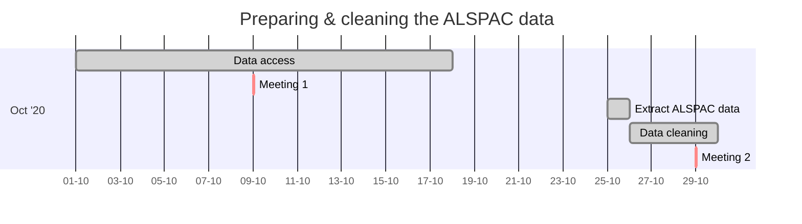
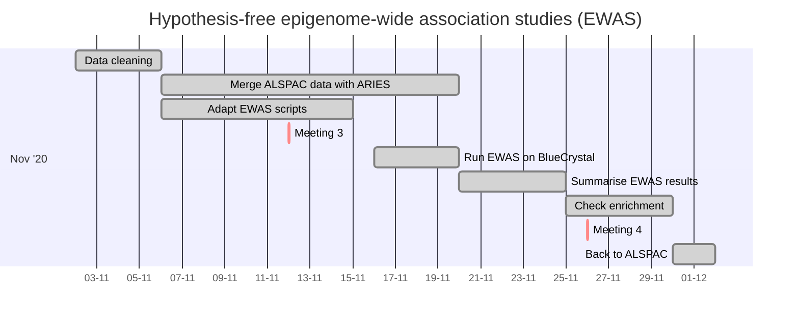
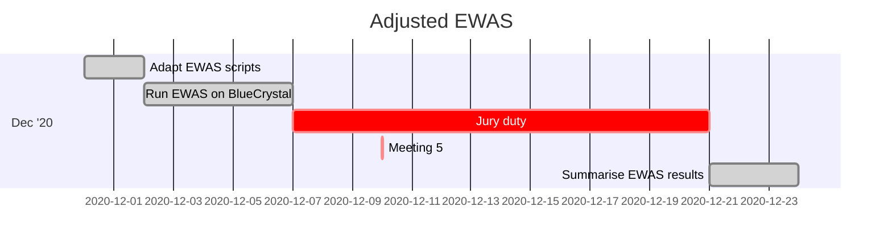
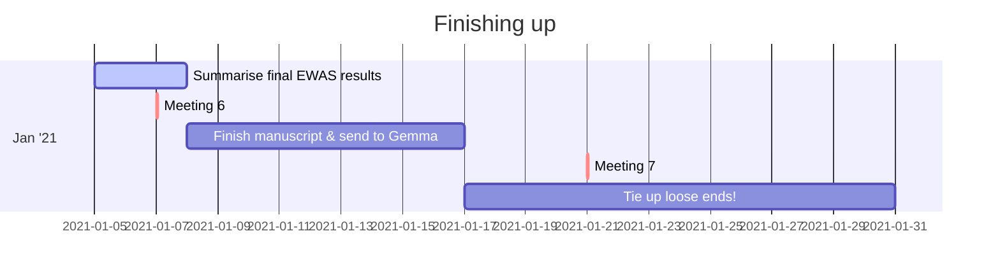
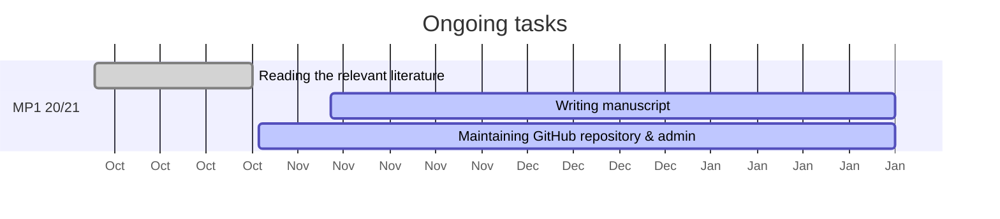

# Gantt chart for mini project 1
## 01/10/2020 - 31/10/2021
### Flo Martin

```mermaid
gantt
    dateFormat  YYYY-MM-DD
    title       Preparing & cleaning the ALSPAC data
    axisFormat  %d-%m
 
    section Oct '20
    Data access                               :done,   des1, 2020-10-01, 17d
    Meeting 1                                 :crit, done,   2020-10-09, 1h
    Extract ALSPAC data                       :done,   des2, 2020-10-25, 1d
    Data cleaning                             :done,   des3, 2020-10-26, 2020-10-30
    Meeting 2                                 :crit, done,   2020-10-29, 1h
```

```mermaid
gantt
    dateFormat  YYYY-MM-DD
    title       Hypothesis-free epigenome-wide association studies (EWAS)
    axisFormat  %d-%m
    
    section Nov '20
    Data cleaning                             :done, 2020-11-02, 2020-11-06
    Merge ALSPAC data with ARIES              :done, 2020-11-06, 14d
    Adapt EWAS scripts                        :done, 2020-11-06, 9d
    Meeting 3                                 :crit, 2020-11-12, 1h
    Run EWAS on BlueCrystal                   :done, des5, 2020-11-16, 2020-11-20
    Summarise EWAS results                    :done, des6, after des5, 5d
    Check enrichment                          :done, des7, after des6, 5d
    Meeting 4                                 :crit, 2020-11-26, 1h
    Back to ALSPAC                            :done, des8, after des7, 2d
```

```mermaid
gantt
    dateFormat  YYYY-MM-DD
    title       Adjusted EWAS
    
    section Dec '20
    Adapt EWAS scripts                        :done, des9, 2020-11-30, 2020-12-02
    Run EWAS on BlueCrystal                   :done, des10, after des9, 5d
    Jury duty                                 :crit, 2020-12-07, 14d
    Meeting 5                                 :crit, 2020-12-10, 1h
    Summarise EWAS results                    :done, des11, 2020-12-21, 3d
```

```mermaid
gantt
    dateFormat  YYYY-MM-DD
    title       Finishing up
    
    section Jan '21
    Summarise final EWAS results              :active, des12, 2021-01-05, 2021-01-08
    Meeting 6                                 :crit, 2021-01-07, 1h
    Finish manuscript & send to Gemma         :des13, after des12, 9d
    Meeting 7                                 :crit, 2021-01-21, 1h
    Tie up loose ends!                        :des14, after des13, 2021-01-31
```

```mermaid
gantt
    dateFormat  YYYY-MM-DD
    title       Ongoing tasks
    axisFormat  %b
    
    section MP1 20/21
    Reading the relevant literature           :done, 2020-10-01, 2020-10-25
    Writing manuscript                        :active, 2020-11-06, 2021-01-31
    Maintaining GitHub repository & admin     :active, 2020-10-26, 2021-01-31
```
